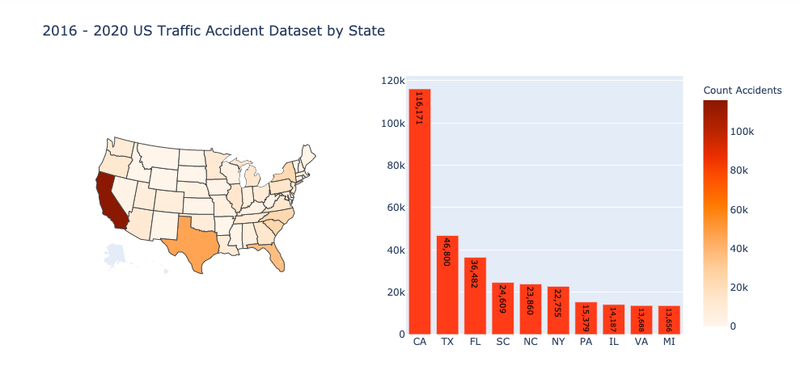

## US Accident severity prediction

This [dataset](https://www.kaggle.com/sobhanmoosavi/us-accidents) contains countrywide traffic accident data, which covers 49 states of the United States. 
The data is continuously being collected from February 2016 until June 2020, using several data providers, including two APIs which provide streaming 
traffic event data. These APIs broadcast traffic events captured by a variety of entities, such as the US and state departments of transportation, 
law enforcement agencies, traffic cameras, and traffic sensors within the road-networks. Currently, there are about 3.0 million accident records in this dataset.

US-Accidents can be used for numerous applications such as real-time car accident prediction, studying car accidents hotspot locations, 
casualty analysis and extracting cause and effect rules to predict car accidents, and studying the impact of precipitation or other 
environmental stimuli on accident occurrence.

For this project, we will use machine learning to predict the severity or accident based on a set of characteristics. We will also create an user friendly 
dash app that will display the visualizations and prediction in real time.

### About the dataset:
The data is provided in terms of a .csv file. Some of the 49 features provided are Source, Description, City, County, State, Humidity, Pressure, 
Visibility, Wind direction, Severity, etc. All features can be found in the data link above, or in the jupyter notebook itself.

### Findings and visualizations
Below are some findings that were discovered during exploratory data analysis process:

* The bar chart above shows the number of accidents per year. It looks like 2019 has the largest number of accident so far. However, since our dataset only contains 
data from 2016 to June of 2020, I would expect 2020 number to increase as the year progresses. It would be interesting to see the impact of Covid-19 on accident counts, 
since a lot of people are working from home this year.

* According to the bar chart, Fridays are when accidents occur more often, while Saturdays and Sundays have the smallest number of accidents.

* The state with the highest number of accidents from 2016-June 2020 is California.

### Streamlit data dashboard

The project also contain a data app that allow users to interact with data visualizations and make real time prediction on accident severity.
